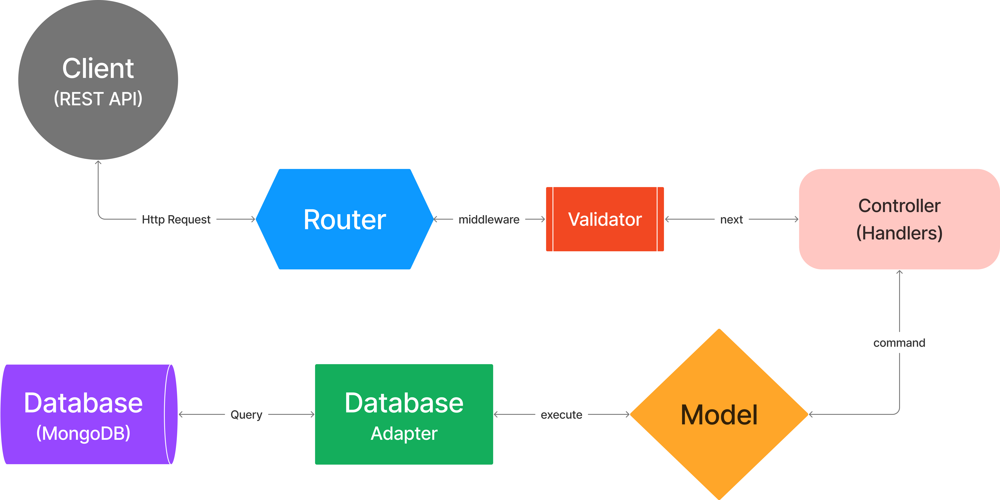

# High Level Design

## Overview

This document describes the high-level design of the application.

## Design

The application is designed as follows:

- The application is built using Node.js and Express.js.
- The application uses MongoDB as the database.
- The application follows the MVC (Model-View-Controller) architecture.
- The application is structured into different modules such as `config`, `controllers`, `models`, `routes`, `tests`, and `utils`.
- The application is written in TypeScript.
- The application uses environment variables for configuration.
- The application uses a logger for logging.
- The application uses validators for input validation.
- The application uses jest for testing.

## Modules

- `config` - Contains the configuration files.
- `controllers` - Contains the controllers of the application.
- `models` - Contains the models of the application.
- `routes` - Contains the routes of the application.
- `tests` - Contains the tests of the application.
- `utils` - Contains the utility functions of the application.
- `docs` - Contains the documentation of the application.

## Graphical Representation

The following diagram represents the high-level design of the application:

